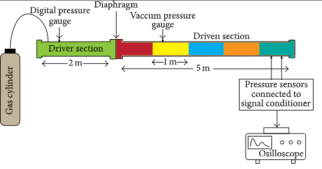

# Shock Tube
The Shock Tubes are devices that used to evaluate the responsiveness of pressure transducers. The design of a shock tube is simple. There's a long pipe with a diaphragm separating high pressure gas and low pressure gas. This diaphragm can be a rupture disk that burst at a certain pressure; when this happens there is rapid expansion of gasses from high pressure to low pressure creating a traveling shock wave. 



# Governing Equations

```math
\frac{\partial}{\partial t} \begin{bmatrix} 
\rho \\
\rho v \\ 
e
\end{bmatrix} 
+
\frac{\partial}{\partial x} \begin{bmatrix}
\rho v \\
\rho v^2 + P \\
v(e+P)
\end{bmatrix} = 0
```

Where 
```math
P = (\gamma - 1)(e-\frac{1}{2} *\rho v^2)
```

and $\gamma = 1.4$ 

Internal Energy is 
```math
e = c_v * T 
```

```math
c_v = \frac{k}{\mu} * \frac{1}{\gamma-1}
```

Viscosity $\mu$ and thermal conductivity $k$ for air needs to be looked up. Units of $c_v$ is J/(Kg K)