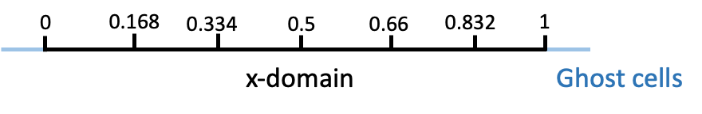

# AUSM Scheme for solving shocktube problems
The purpose of this code is to demonstrate the solving of a shock tube using AUSM. 

> Reference:
> M.-S. Liou and C. J. Steffen Jr., A new flux splitting scheme, J. Comput. Phys. 107, 23 (1993). First order scheme.

## Procedure

Step 1: Define the shocktube domain and initial variables

Domain
```python
    CFL    = 0.50               # Courant Number
    gamma  = 1.4                # Ratio of specific heats
    ncells = 400                # Number of cells
    x_ini =0.; x_fin = 1.       # Limits of computational domain
    dx = (x_fin-x_ini)/ncells   # Step size
    nx = ncells+1               # Number of points
    nghost_cells = 10           # Number of ghost cells on each boundary
    x = np.linspace(x_ini,x_fin,nx) # Mesh
```


Initial Conditions
```python

```